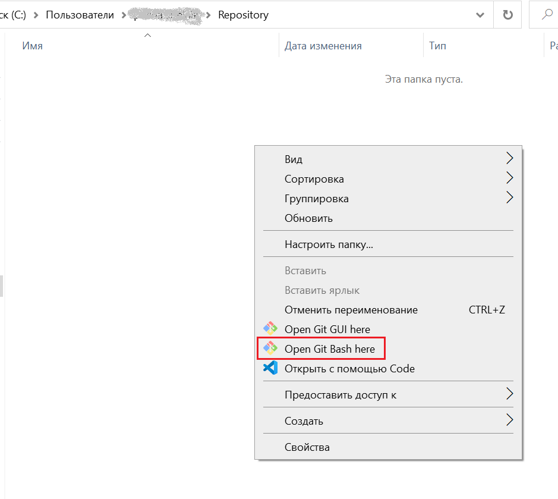
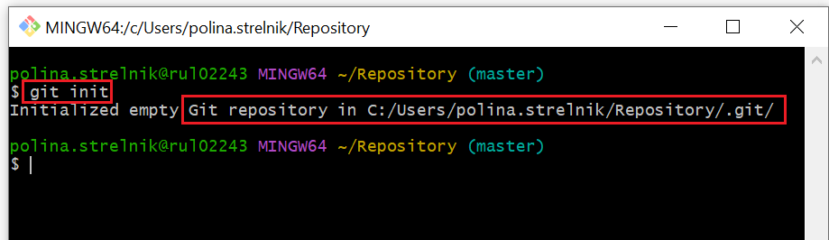
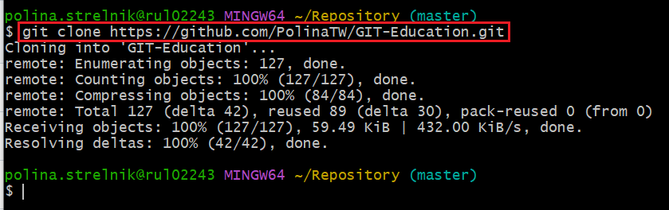

# Git-Education
# **Мануал. Git для работы с документацией IT**   
## **Что такое Git**   
**Кратко**: Git - система контроля версий.   
**Развернуто**: Git - программа, используемая для контроля версий продуктов IT в процессе их написания и с выбором окончательной версии продукта.   
- Сегодня с помощью Git контролируется как программный код, так и IT-документация (на основе принципов Git возник принцип **docs-as-code**).   
- Git широко используется во всем мире как система контроля версий.             
## **Что обеспечивает Git**   
- Возможность версионировать код, текст и прочий контент во время его написания, что позволяет для эффективнее устранять ошибки, выбирать наилучший вариант из разных версий.
- Возможность коллективно работать над IT-продуктом: каждый разработчик в команде контролирует отдельную версию, затем одна из данных версий становится окончательной и идет в production.     
- Возможность хранить и восстанавливать историю кода, текста и т.д.     
## **Общие принципы работы с Git**   
`Далее используется общее слово "текст" для обозначения кода, текста, таблиц, иллюстраций и других компонентов IT-продукта.`  
- Версии редактируются и хранятся в репозиториях IT-продукта (на ПК это обычная папка для работы с Git, на сайте Git - создаваемый пользователем раздел). 
- Для работы с версиями используются **локальные и удаленные репозитории**, между которыми происходит обмен версиями: в локальном репозитории находятся *черновые* версии текста, в удаленный репозиторий выливается **основная версия**.  
- Для разграничения версий текста в Git создаются **ветки** разработки или **branches**. Одна версия текста равна одной ветке.   
- Фиксирование изменений в версии и отправка этих изменений в другую версию происходит в несколько команд. Команды выполняются в окне Terminal (консоль) 
- При возникновении "конфликтов" версий разработчики выполняют команды в консоли по автомтическому разрешению конфликтов, а также договариваются    
- **Программы Git**: Git GUI, Git Extension, Git в составе программы разработки кода VS Code и другие, веб-браузерные Git и т.д.     
## **Понятия, используемые в GIT**
## **Установка и настройка GIT**  
`Здесь описана установка Git для ОС Windows.`   
Сначала необходимо убедиться в отсутствии установки на ПК Git через команду в терминале ОС `git --version`. Если терминал покажет наличие Git нужной версии, установка не нужна.     
1. Скачать Git по ссылке [git-csm.com](https://git-scm.com/download/win)   
2. Запустить установщик программы. В окнах установки выполнить настройки:   
- Выбрать программу `Git Bash` - специального терминала для Git. 
- Разрешить использование терминала/командной строки для Git: `Integrate Git with the Windows Shell`   
## **Создать репозиторий локальный git init**   
1. Выбрать или создать на ПК папку, которая станет репозиторием.    
2. Находясь в папке, открыть терминал Git Bash: правой кнопкой мыши открыть локальное меню и выбрать **Open Git Bash here**   

3. В терминале выполнить команду `git init` - появится сообщение о создании репозитория на ПК внутри текущей папки. Одновременно в репозитории создастся главная ветка под названием **master** или **main**, что покажет терминал, например:   

**Далее в репозиторий необходимо добавить файлы с текстом, в которых будет вестись работа с созданием версий=веток редактирования**.
## **Создать репозиторий удаленный**   
Как правило, в удаленный репозиторий (УР) "выливается" окончательная версия текста из локальных репозиториев, в которых находятся промежуточные версии текста.
Также в УР может вестись и основная работа в разных версиях-ветках.
УР может находиться в веб-системе Git: GitHub, GitLab и др. Здесь описано создание УР в GitHub.   
1. Пройти регистрацию на GitHub или GitLab.   
2. .   
## Клонировать удаленный репозиторий в локальный   
**Клонирование репозиториев** - это настройка связи между локальным и удаленным репозиторием, обеспечивающей обмен информацией и выливание изменений в разные ветки между репозиториями, включая основную ветку master/main.   
1. В локальном репозитории открыть терминал **Git Bash**.   
2. Выполнить команду `git clone [ссылка на удаленный репозиторий]`. 
Пример успешного клонирования:   

**Примечание**: Если в УР уже были файлы или папки, они клонируются в ЛР. 
## **Создать новую ветку в локальном репозитории**
## **Индексировать изменения**
## **Коммитить изменения**
## **Замержить изменения**
## **Решить возникшие конфликты**
## **Запушить из локального репозитория в удаленный**
  
git add .   
git clone   
git branch   
git checkout      
git add   
git commit   
git remote   
git push   
git pull   
git status   
git merge  
git init  

3 вариант
Установка   
Настройка   
Создание репозитория   
Рабочий процесс   
git add: добавление файлов в индекс   
git status: проверка статуса репозитория   
git commit: добавление файлов в репозиторий   
git log: просмотр журнала коммитов   
git show: просмотр коммита   
git diff: просмотр изменений до коммита   
git difftool: запуск внешнего инструмента сравнения файлов   
git restore: отмена изменений   
git rm: удаление файлов из индекса   
git reset: откат коммита   
   
git branch <branch_name>: создание новой ветки   
git branch: просмотр веток   
git checkout: переключение между ветками   
git merge: слияние репозиториев   
git branch -d <branch_name>: удаление ветки   
Удалённый репозиторий   
git remote add origin url: привязка локального и удалённого репозитория  
git remote: просмотр удалённых репозиториев   
git remote — v: просмотр удалённых URL-адресов   
git push: отправка изменений в удалённый репозиторий   
git pull: получение изменений из удалённого репозитория   
Практика по основным командам Git   
-a   
-m      
-u    

